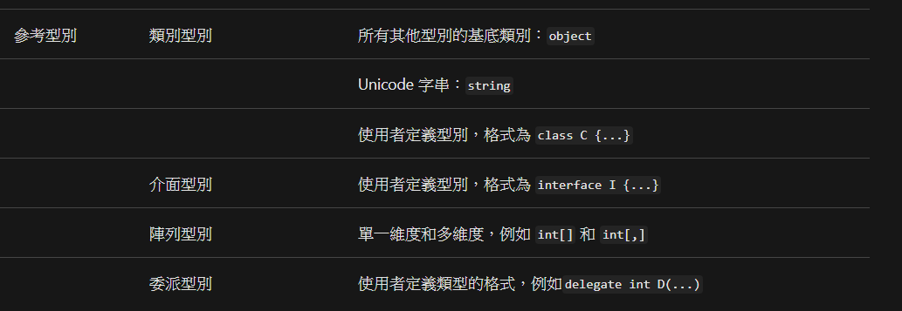

# C#資料類型
C#的資料類別分為幾大類:
- 實值型別 (Value types)
- 參考型別 (Reference types)
- 指針（Pointer types）-unmanage
---
## 實值型別 (Value types)

對應的資料內容:


## 參考型別 (Reference types)


---
## 指針（Pointer types）-unmanage

在C#中不建議使用
<br/>
# C#類型轉換
- 隱含轉換
- 明確轉換(強轉型)
---

## 隱含轉換

```C#
int num = 2147483647;
long bigNum = num;
```
針對參考型別，一律會執行從某個類別到其任何一個直接或間接基底類別或介面的隱含轉換。 因為衍生類別一律會包含基底類別的所有成員，所以不需要特殊語法。

```C#
Derived d = new Derived();  
Base b = d; // Always OK.
```
---
## 明確轉換(強轉型)
```C#
class Test
{
    static void Main()
    {
        double x = 1234.7;
        int a;
        // Cast double to int.
        a = (int)x;
        System.Console.WriteLine(a);
    }
}
// Output: 1234
```
針對參考型別，如果您需要將基底類型轉換為衍生類型，則需要明確轉換
```C# 
Giraffe g = new Giraffe();  
Animal a = g;    
Giraffe g2 = (Giraffe) a;
```
轉換方式:
```C#
System.Convert
```
轉為字串可用ToString()
```C#
int i = 75;
Console.WriteLine(i.ToString());
```
---
## 番外篇 - Boxing 和 Unboxing
Boxing: 任何型別 -> object(隱含轉換)

Unboxing: object -> 任何型別(明確轉換)
```C#
int i = 123;
// The following line boxes i.
object o = i;
o = 123;
i = (int)o;  // unboxing
```
