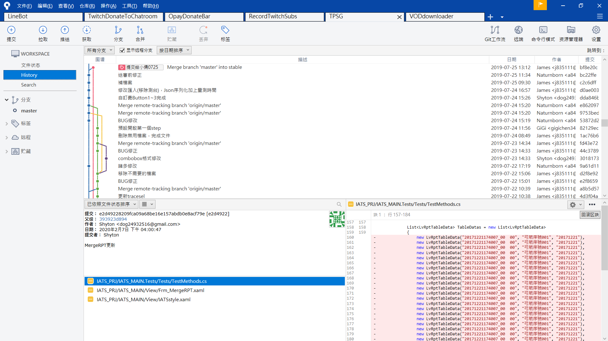
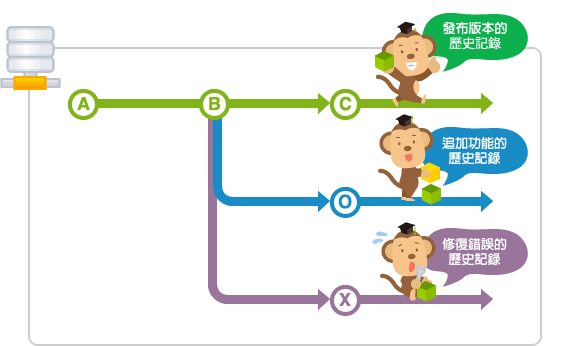
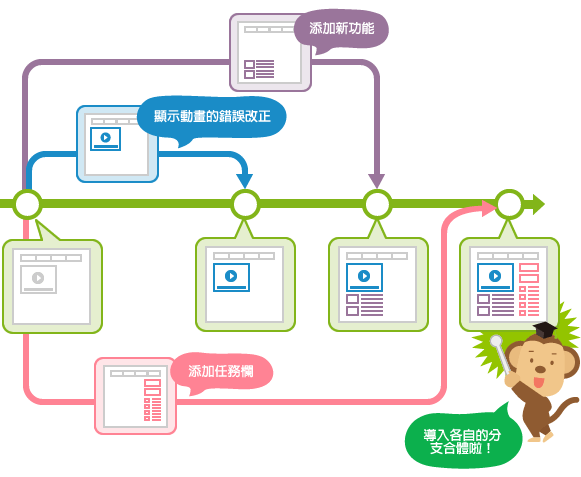

# Git 版本控制

Git是一個分散式的版本控制系統

---
如果在寫程式時想要把每一步的改動都記錄下來，往後要是想取消部分改動會怎麼做呢?

但是這樣就需要每次都回頭去看程式碼，比對。

如果只有一個人進行開發，還可以用這樣的方式。

如果是團隊進行開發呢?

---

 以下使用SourceTree來進行Git的教學

 

上圖為SourceTree的軟體畫面
(GitHub)
- 安裝

- 改動查看

- Commit

    [Commit Message](https://wadehuanglearning.blogspot.com/2019/05/commit-commit-commit-why-what-commit.html)

- push
- pull

---

# branch(分支)

在開發軟體時，可能同時會有多人在開發同一功能或修復錯誤，也可能會有多個發佈版本的存在，並且需要針對每個版本進行維護。

為了能支援同時進行數個功能的增加或版本控制，Git具備了分支的功能。

分開的分支還是可以和其他分支合併的。

為了讓群組的成員不受其他成員的影響，您可以在主要分支建立自己專用的分支。完成作業的成員們，將自己分支的修改導入到主要分支，這樣大家都可以不受其他成員的影響，導入自己的修改內容。而且每個提交的歷史記錄都會被儲存，當發生問題時，可以更容易找到發生問題的地方。

- Merge
  - conflict

---
進階
- Rebase
- Cherry Pick