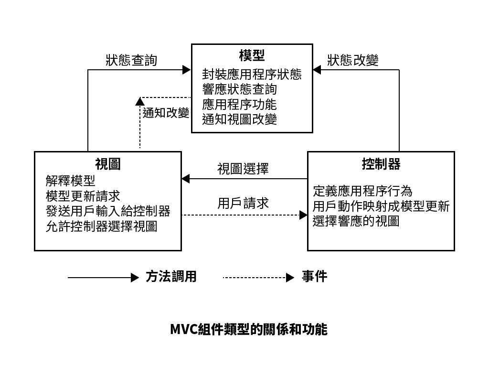

# MVC(Model-View-Controller)架構
MVC模式最早由Trygve Reenskaug在1978年提出 ，是全錄帕羅奧多研究中心（Xerox PARC）在20世紀80年代為程式語言Smalltalk發明的一種軟體架構。MVC模式的目的是實現一種動態的程式設計，使後續對程式的修改和擴充功能簡化，並且使程式某一部分的重複利用成為可能。除此之外，此模式通過對複雜度的簡化，使程式結構更加直覺。軟體系統通過對自身基本部分分離的同時也賦予了各個基本部分應有的功能。

- **Model** 
    - 負責定義資料的結構與資料庫的連接，當View或Controller提出請求資料或變更狀態時更新資料庫，例如新增、更新、刪除菜單，並將最新的狀態回傳給View。
- **View** 
    - 呈現Model提供的資料。而使用者介面上的動作也會影響Controller的行為。
- **Controller** 
    - 負責決定當前需要呈現的畫面以及根據使用者行為將view與model搭配連結，例如使用者選擇查看菜單，Controller就會選擇呈現菜單的畫面請view顯示，並且請model將菜單的資料傳給view呈現。

## 優點
- 讓習慣代替配置
    - 而因為大家對於MVC有相同的認識，在不改動底層運作的情況下,屬於Controller的Class就該放到Controllers的資料夾、屬於頁面呈現的就放到Views資料夾，且預設也有一個Models的資料夾給你放Model，有了這些規範後,讓習慣來代替配置,你接手別人的MVC專案後, 所有人的開發方式基本上都會依照這個規範去落實,降低維護的成本。
- 關注點分離
    - 如果你今天在處理使用者操作介面,那就專心的套版,將Controller傳回來的資料看要怎麼擺放,又如果在處理資料流傳入的參數驗證,那就在Controller處理完,不用去管會不會影響到View的呈現, 如果是跟資料庫的溝通,就在Model裡將它實作好,不需要擔心是否參數有空值或Null, 因為那些該是在Controller處理掉的。

    - 相較於以前的WinForm開發方式,因為UserControl介於頁面跟Code Behind的事件之間,常常耦合度太強,一改兩邊都會動到，需要較嚴謹的開發規範才能避免耦合問題,而且我記憶最深的就是UserControl間的生命週期,那個互相攪在一起要改還真的要人命...
- 前端更自由
    - 在Dot Net MVC中,不再有User Control這類的元件存在,所以前端會更加的自由,無論是在JS或是CSS的運用上，再也不會有元件在Render時幫你加上一堆多餘的Tag或是Class。