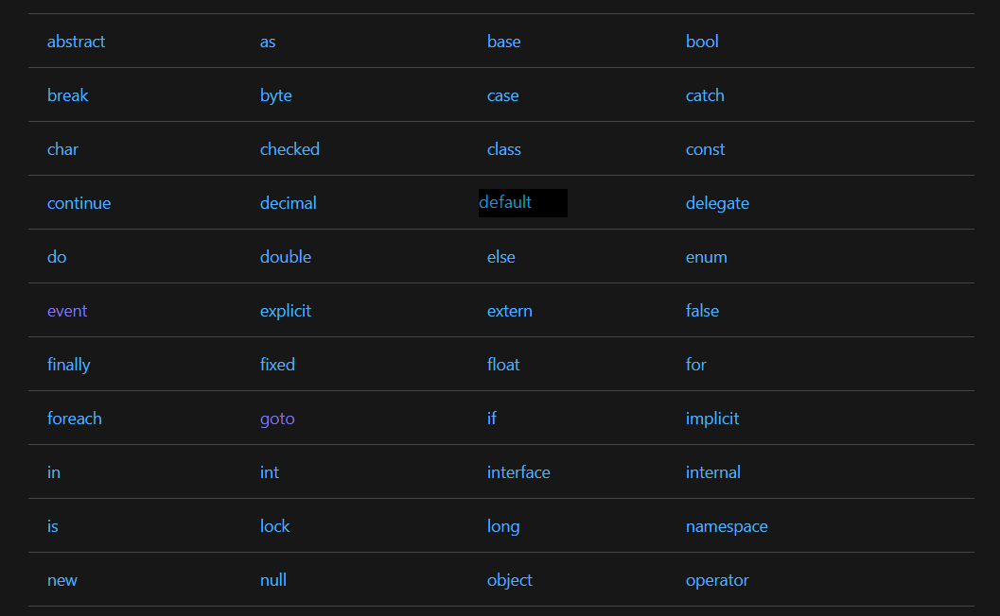
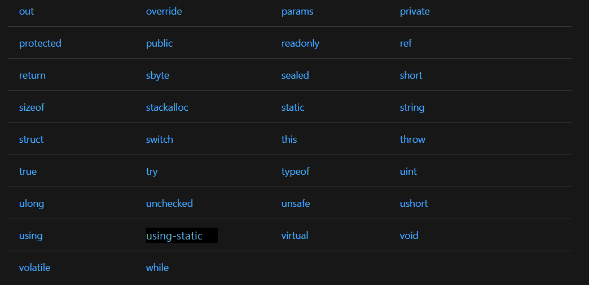
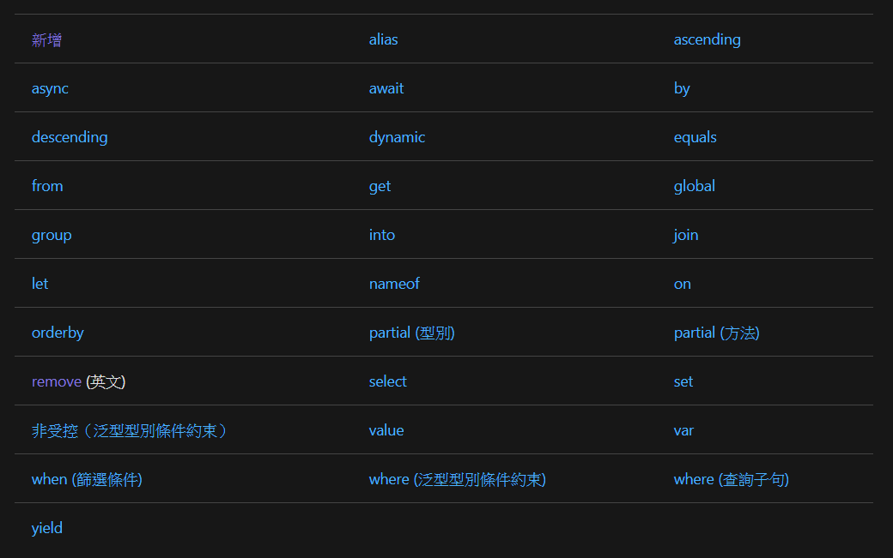

# C# 基本語法

```C#
using System;
namespace RectangleApplication
{
    class Rectangle
    {
        // 變數成員
        double length;
        double width;
        public void Acceptdetails()
        {
            length = 4.5;    
            width = 3.5;
        }
        public double GetArea()
        {
            return length * width;
        }
        public void Display()
        {
            Console.WriteLine("Length: {0}", length);
            Console.WriteLine("Width: {0}", width);
            Console.WriteLine("Area: {0}", GetArea());
        }
    }
   
    class ExecuteRectangle
    {
        static void Main(string[] args)
        {
            Rectangle r = new Rectangle();
            r.Acceptdetails();
            r.Display();
            Console.ReadLine();
        }
    }
}
```
---
## C#程式結構
- using關鍵字
- class關鍵字
- C#中的註解
  - //
  - /* */
- 成員變數
- 成員函數
- 標識符(identifier，縮寫為ID，又稱為識別碼) 
> 命名規則:
>
> - 標識符必須以字母、下劃線或 @ 開頭，後面可以跟一系列的字母、數字（ 0 - 9 ）、下劃線（ _ ）、@。
> - 標識符中的第一個字元不能是數字。
> - 標識符必須不包含任何嵌入的空格或符號，比如 ? - +! # % ^ & * ( ) [ ] { } . ; : " ' / \。
> - 標識符不能是 C# 關鍵字。除非它們有一個 @ 前綴。 例如，@if 是有效的標識符，但 if 不是，因為 if 是關鍵字。
> - 標識符必須區分大小寫。大寫字母和小寫字母被認為是不同的字母。
> - 不能與C#的類庫名稱相同。
---
## C# 關鍵字(保留字)

保留關鍵字(Reserved Keywords)

---



內容關鍵字(Contextual Keywords)
